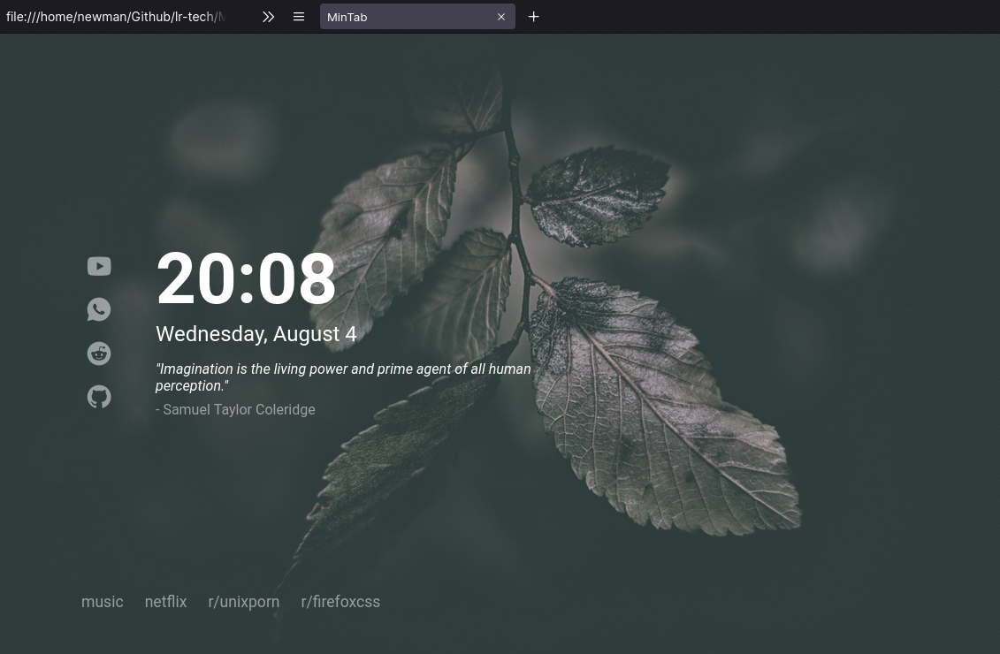

# MinTab

_A minimal, elegant, easy to configure startpage._




## Features

- Themeable.
- Easy to configure.
- Time format can be set to 24 or 12 hours (24h is default).
- New quotes everytime you open a new tab.
- Full icons support from [Remix Icon](https://remixicon.com/).


## Usage

#### As Home Page:

1. Fork this repo.
2. Enable the Github Pages service `Settings > GitHub Pages > Source [master branch] > Save`.
3. Set it as Home Page:
   - Click the menu button. and select `Options`. `Preferences`.
   - Click the Home panel.
   - Click the menu next to Homepage and new windows and choose to show custom URLs and add your `Github Pages link`

#### As New Tab:

You can use different Add-ons/Extensions for it

- If you use Firefox: [Custom New Tab Page](https://addons.mozilla.org/en-US/firefox/addon/custom-new-tab-page/?src=search)
- If you use Chromium (Brave, Vivaldi, Chrome): [Custom New Tab URL](https://chrome.google.com/webstore/detail/custom-new-tab-url/mmjbdbjnoablegbkcklggeknkfcjkjia)


## Customization

### Links

You can change icons and list links in the `config.js` file. Just select an icon from [Remix Icon](https://remixicon.com/) or a name, and a link: 

```javascript
const ICONS = [
  {
    icon: "ri-youtube-fill",
    link: "https://www.youtube.com/"
  },
  {
    icon: "ri-whatsapp-fill",
    link: "https://web.whatsapp.com/"
  },
  {
    icon: "ri-reddit-fill",
    link: "https://www.reddit.com/"
  },
  {
    icon: "ri-github-fill",
    link: "https://www.github.com/"
  }
]

const LIST_ITEMS = [
  {
    name: "music",
    link: "https://music.youtube.com"
  },
  {
    name: "netflix",
    link: "https://www.netflix.com/"
  },
  {
    name: "r/unixporn",
    link: "https://www.reddit.com/r/unixporn/"
  },
  {
    name: "r/firefoxcss",
    link: "https://www.reddit.com/r/firefoxcss/"
  },
]
```

You can copy this format and add as many links as you want.

### Clock

Also, you can set hour format for 24 or 12 hour clock in the `config.js` file. Just set `show12h` to `true` or `false`:

```javascript
const CONFIG = {
  show12h: false,
}
```


### Theme

You can change colors, font and animation speed at the top of the `styles.css` file:

```css
:root {
  --fgColor   : #ffffff; /* foreground color */
  --bgColor   : #212121; /* background color */
  --bgFilter  : rgba(0, 0, 0, 0.1); /* background image filter */
  --font      : "Roboto"; /* custom font */

  --animationSpeed  : 0.2s; /* speed for animations when hovering/resizing */
}
```

Also, you can change the background image by overwriting the `bg.jpg` file.
