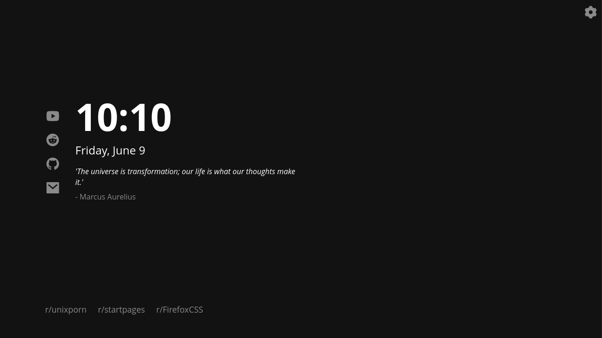
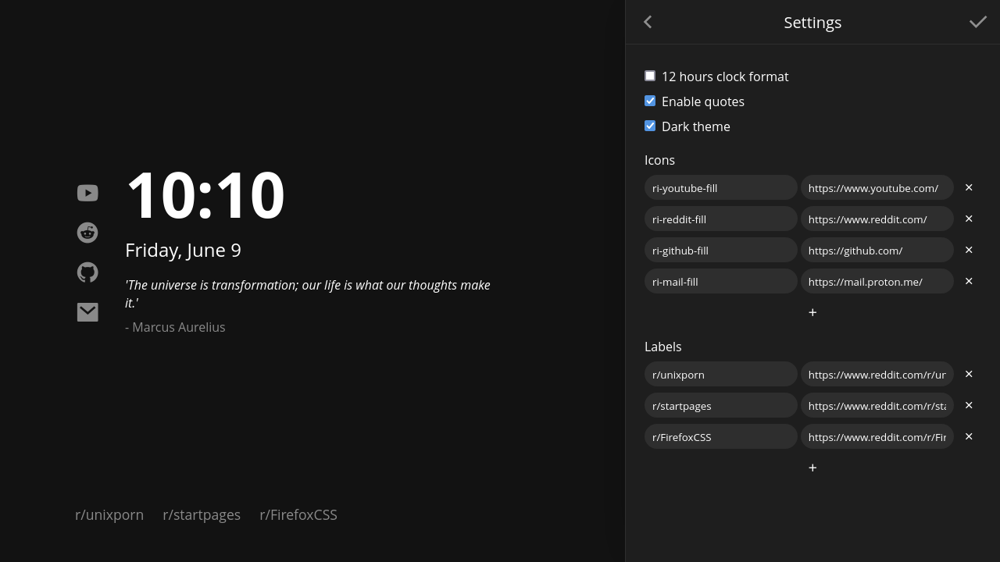

# mintab

_A minimal, elegant, easy to configure startpage._

| Dark | Light |
| ---  | ---   |
|  |  |
|  |  |

## Features

- Themeable.
- User friendly settings window.
- Time format can be set to 24 or 12 hours.
- New quotes everytime you open a new tab.
- Full icons support from [Remix Icon](https://remixicon.com/).

## Usage

### As Home Page

Simply set `https://newmanls.github.io/mintab/` as your home page URL.

### As New Tab

You can use different Add-ons/Extensions for it:

- On Firefox: [Custom New Tab Page](https://addons.mozilla.org/en-US/firefox/addon/custom-new-tab-page/?src=search)
- On Chromium-based browsers (Google Chrome, Brave, etc.): [Custom New Tab URL](https://chrome.google.com/webstore/detail/custom-new-tab-url/mmjbdbjnoablegbkcklggeknkfcjkjia)


## Customization

**mintab** is easily customizable. Just open the settings window by clicking the cog icon on the top-left corner. There you can change settings such as:

- Clock format (12/24 hours)
- Enable/disable quotes
- Enable/disable dark theme
- Add and remove iconic and labeled links

### Adding iconic links

In order to add iconic links, you have to find the icon class name you want from the [Remix Icon website](https://remixicon.com/) (i.e.: `ri-github-fill`) and paste it on the `Icon` field.

### Additional theming

For more in-depth customizacion, theme colors and font can be modified at the top of the `styles.css` file:

```css
:root {
    --font: 'Open Sans';

    --bg0-light: #f9f9f9;
    --bg1-light: #f9f9f9;
    --bg2-light: #dcdcdc;
    --fg0-light: #000000;
    --fg1-light: #b9b9b9;
    --accent-light: #8ab4f8;

    --bg0-dark: #121212;
    --bg1-dark: #1e1e1e;
    --bg2-dark: #2e2e2e;
    --fg0-dark: #ffffff;
    --fg1-dark: #6f6f6f;
    --accent-dark: #8ab4f8;
}
```

## Thanks to

- [imreyesjorge/root-startpage](https://github.com/imreyesjorge/root-startpage): A simple and clean startpage.
- [migueravila/Bento](https://github.com/migueravila/Bento): Minimalist, elegant and simple startpage inspired by the Bento box!.
- [teiem1](https://www.reddit.com/user/Teiem1/): [r/startpages](https://www.reddit.com/r/startpages/) moderator.
- [ratabb](https://github.com/ratabb): for implementing a quotes api.
